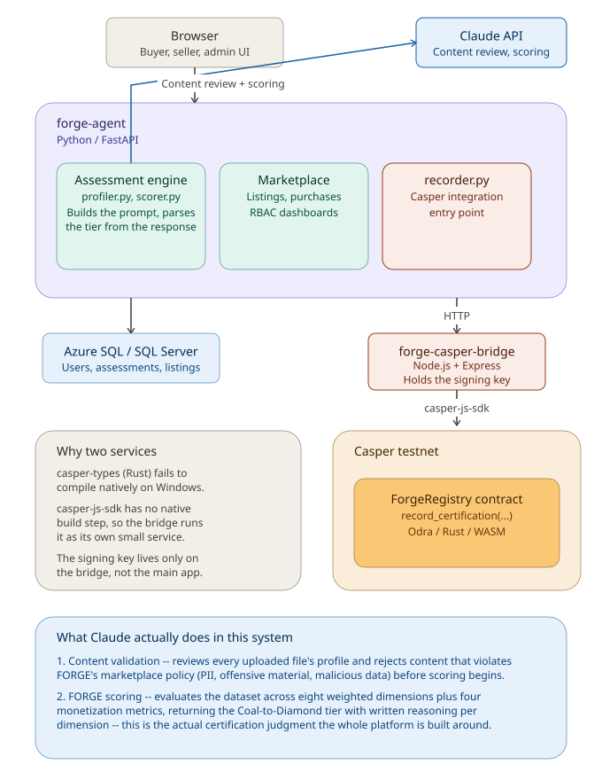

# FORGE Agent — Architecture

This document describes how FORGE Agent's pieces fit together: the application services, the data stores, the AI and blockchain integrations, and how requests flow through the system end to end.

---

## High-Level Overview

FORGE Agent is built as **two cooperating services** plus a database, rather than a single monolith:

1. **`forge-agent`** — the main Python/FastAPI application. Handles assessment scoring, the marketplace, user accounts, the frontend pages, and all business logic.
2. **`forge-casper-bridge`** — a small Node.js service whose only job is signing and submitting transactions to the Casper testnet on FORGE Agent's behalf.

These two services are deliberately separated because of a real, encountered constraint: Casper's Rust-based tooling (`casper-types`, `pycspr`) has Unix-only file-permission code that fails to compile natively on Windows. Rather than fight that constraint inside the main Python app, the Casper-specific logic lives in its own small Node.js service (using `casper-js-sdk`, a pure-JavaScript library with no native compilation step), and the Python app talks to it over a simple internal HTTP API. This also means the two services can be deployed and scaled independently, and the signing key never needs to live anywhere near the public-facing API.

*Diagram: the browser talks to `forge-agent`, which calls out to the Claude API for content review and scoring, persists to Azure SQL / SQL Server, and hands off Casper testnet anchoring to the `forge-casper-bridge` service.*

---

## Component Breakdown

### 1. `forge-agent` (Python / FastAPI)

The main application. Responsibilities:

- **Assessment engine** (`ai/profiler.py`, `ai/scorer.py`) — ingests an uploaded CSV/Excel file, profiles its columns, and calls the Claude API (see below) to run content validation and produce the actual FORGE score.
- **Marketplace** (`api/main.py` — listings, transactions, purchases) — lets certified datasets be listed for sale, browsed, and purchased via an x402-style payment flow with live CSPR/fiat pricing.
- **Role-based access control** — three roles (buyer, seller, admin), non-exclusive, with each dashboard showing only what that role should see.
- **Frontend** (`frontend/*.html`) — server-rendered-by-FastAPI static pages: assessment, registry, marketplace, buyer dashboard, seller dashboard, registration, login, admin.
- **Database access** (`database/connection.py`, `database/models.py`) — SQLAlchemy ORM, works against either local SQL Server (dev) or Azure SQL (production), toggled via `.env`.
- **Casper integration entry point** (`casper/recorder.py`) — the only place in this service that knows about Casper at all. It does not talk to the blockchain directly; it makes an HTTP call to the Casper bridge service (see below) and normalizes the result.

### 2. Claude API

This is not a peripheral feature — Claude's output **is** the certification judgment the entire platform is built around. `forge-agent` calls the Claude API at two distinct points in the assessment flow:

- **Content validation** — before any scoring happens, the file's profile (column names, sample values, detected PII signals) is sent to Claude with a system prompt instructing it to reject datasets containing sexual or hateful content, profanity, sensitive personal identifiers (SSNs, account numbers, passwords), or content that appears fabricated to disrupt the platform. This is what produces the clear, policy-referencing rejection message a seller sees if their upload doesn't pass review.
- **FORGE scoring** — for files that pass validation, Claude evaluates the dataset's column profile across the eight weighted FORGE dimensions (data quality, compliance, reliability, refresh frequency, governance, accessibility, business relevance, sustainability) plus four monetization metrics (uniqueness, coverage, historical depth, enrichment potential), returning a weighted score, the resulting Coal-to-Diamond tier, and written reasoning for each dimension.

Without this call, FORGE Agent has no certification methodology to offer — the eight-dimension framework only becomes a real, applied judgment because Claude is the one reading the data's actual shape and producing a defensible, explained score rather than a fixed formula. The scoring prompt and response-parsing logic live in `ai/scorer.py`; the content-validation prompt lives in `ai/profiler.py`.

### 3. `forge-casper-bridge` (Node.js / Express)

A minimal service with one real job: take a dataset hash, score, and tier, and call `record_certification` on the deployed `ForgeRegistry` smart contract.

- **`server.js`** — the Express app. Exposes:
  - `GET /health` — liveness check
  - `POST /record-certification` — signs and submits the actual on-chain transaction, given `{ datasetHash, score, tier }` and a shared-secret API key header
- Holds the Casper testnet signing key (as a base64-encoded environment variable, decoded at runtime — see *Secrets Management* below)
- Performs a balance pre-check before attempting a transaction, since testnet CSPR cannot be re-requested once a wallet is drained
- Returns structured, categorized errors (`network_unreachable`, `out_of_gas`, `insufficient_balance`, etc.) so the calling application can show specific, actionable messages rather than generic failures

This service can run two ways, both using the identical code:
- **Locally**, via `node server.js`, for development — `forge-agent` points at `http://localhost:3000`
- **Deployed**, as its own Azure App Service (`forge-casper-bridge`) — `forge-agent` points at its public Azure URL

`forge-agent` doesn't know or care which one it's talking to; it's just a URL in `.env`.

### 4. `ForgeRegistry` Smart Contract (Rust / Odra / WASM)

A small smart contract deployed once to Casper testnet, written using the Odra framework. Its job is to be the actual, on-chain, verifiable record of certification.

- **`record_certification(dataset_hash, score, tier, timestamp)`** — writes an immutable, indexed record and emits a `CertificationRecorded` event
- **`get_certification(index)` / `get_count()`** — read-only views for verification
- Deployed at a fixed package hash; the bridge service calls this hash directly via `ContractCallBuilder` in `casper-js-sdk`
- Marked `Upgradable: Yes` at deploy time, allowing future entry points to be added without a fresh deployment

The contract source lives in a sibling project (`forge-casper-contract`) since it has its own Rust/Cargo toolchain and build artifacts unrelated to the Python or Node runtimes.

### 5. Database (Azure SQL / SQL Server)

Relational store for everything that isn't on-chain: user accounts and roles, assessment records (including the resulting `casper_tx_hash` once anchored), marketplace listings, and transaction history. Connection target (local SQL Server vs. Azure SQL) is controlled entirely through `.env`, with no code differences between the two.

---

## Request Flow: Running an Assessment

1. User uploads a file via `index.html` → `POST /upload` → `ai/profiler.py` profiles its columns and calls the **Claude API** to run content validation against the file's profile. Files that fail validation (PII, offensive content, etc.) are rejected with a clear, policy-referencing message; nothing further happens until a file passes.
2. User completes the 13-question intake form → `POST /assess` → `ai/scorer.py` calls the **Claude API** again, this time to score the dataset across the eight FORGE dimensions, producing a weighted score, a Coal-to-Diamond tier, and Claude's written reasoning for each dimension.
3. The assessment is saved to the database.
4. `casper/recorder.py` is called to anchor the result on-chain:
   - It computes a local SHA-256 audit hash of the assessment record (for reference, independent of the chain)
   - It calls `forge-casper-bridge`'s `/record-certification` endpoint over HTTP with the dataset hash, score, and tier
   - The bridge signs and submits a transaction calling `record_certification` on the deployed contract
   - The bridge waits for confirmation and returns the **real Casper testnet transaction hash**
5. That real transaction hash (not the local audit hash) is stored as `casper_tx_hash` on the assessment record, and a "View on Casper Testnet ↗" link is shown to the user, resolving directly on `testnet.cspr.live`.
6. If the on-chain call fails for any reason (bridge unreachable, insufficient balance, etc.), the assessment still completes and saves normally — the failure is surfaced as a specific, friendly message rather than blocking the user, and `casper_tx_hash` remains null until a successful anchor occurs.

---

## Secrets Management

- The Casper signing key never lives in the `forge-agent` repo or service. It exists only as an environment variable on `forge-casper-bridge`.
- Because Azure App Settings have proven unreliable at preserving multi-line text values (newlines get silently flattened), the key is stored **base64-encoded** as `CASPER_SECRET_KEY_PEM_B64` and decoded back to real PEM format at runtime inside `server.js`. This sidesteps the newline-preservation problem entirely, since base64 output contains no whitespace or special characters that any transport layer could mangle.
- A shared API key (`CASPER_BRIDGE_API_KEY`) gates the bridge's `/record-certification` endpoint so it isn't callable by the open internet, even though it's a public Azure URL.

---

## Why Two Services Instead of One

This split exists because of a concrete, encountered technical wall, not as an architectural preference for its own sake: `casper-types` (the Rust crate underlying both `pycspr` and the contract's own dependencies) calls Unix-only OS APIs for file permissions, which fail to compile on native Windows. Since local development happened on Windows, and since the working, proven path to calling the deployed contract was `casper-js-sdk` (a pure-JS library with zero native compilation), the pragmatic choice was to keep that working JavaScript code as its own small service rather than rewrite it in Python and risk repeating the same compilation issues in a new, untested tool.

This also turned out to have a genuine architectural benefit: the signing key is now physically isolated from the main public-facing application, and the bridge can be deployed, restarted, or rotated independently of the main app's release cycle.